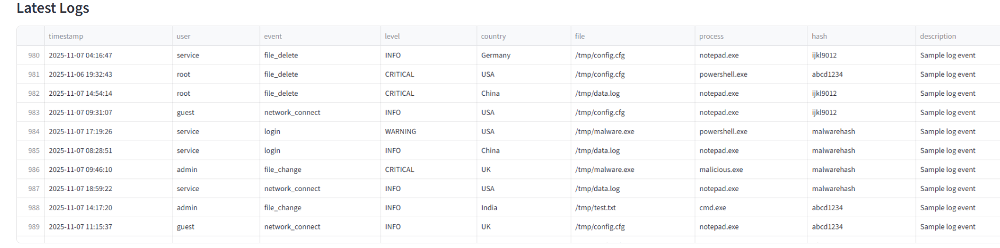
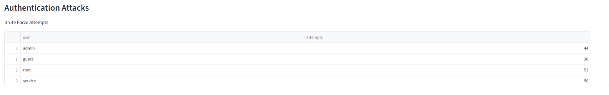
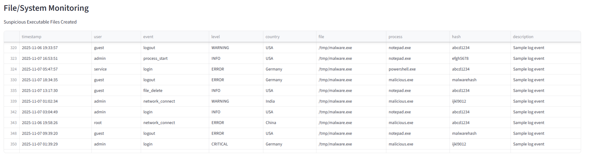
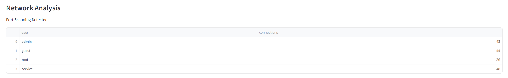
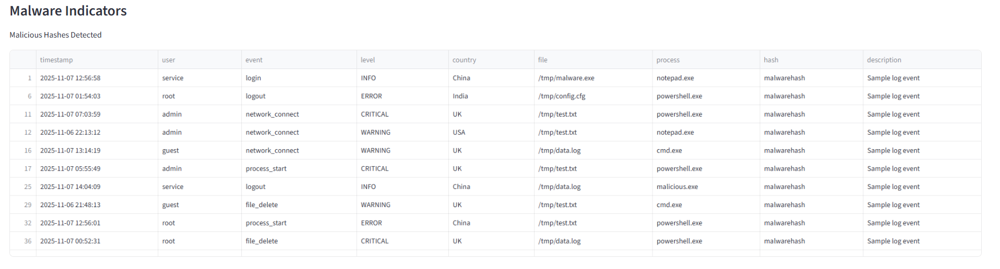
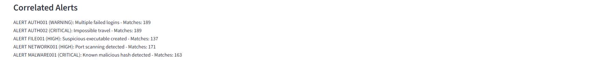
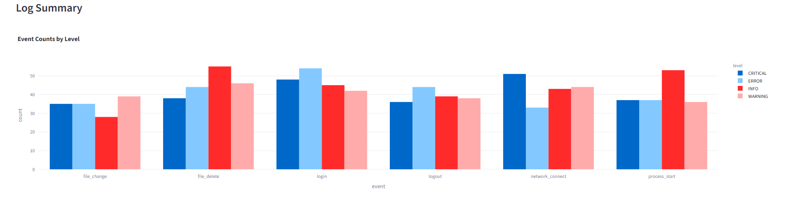

Mini-SIEM Advanced 🚨

Mini-SIEM Advanced is a Security Information and Event Management system built in Python that provides real-time monitoring, anomaly detection, and alerting across system, authentication, file, and network events. It simulates a professional SIEM tool with rule-based detection, threat correlation, and an interactive Streamlit dashboard.

Purpose

The project provides a centralized system to monitor, detect, and respond to cybersecurity threats. It helps security teams identify suspicious activities such as unauthorized logins, malware execution, network attacks, and file tampering. By visualizing threats in an interactive dashboard, Mini-SIEM Advanced allows faster incident detection and response.

Features
Authentication Attack Detection

Detects brute-force login attempts

Detects multiple failed login attempts

Detects logins from different countries

Detects impossible travel events (e.g., login from India → USA within 1 minute)

File/System Monitoring

Detects unauthorized file changes

Tracks creation of suspicious executable files

Detects deletion of critical logs (log tampering)

Network Analysis

Detects port scanning attempts

Detects suspicious outbound traffic

Detects repeated connection attempts

Malware Indicators

Detects execution of suspicious processes

Identifies known malicious hashes

Detects suspicious PowerShell commands

General SIEM Features

CSV/JSON log ingestion

Rule-based alerting with severity levels (Low, Medium, High, Critical)

Alert JSON export

Interactive Streamlit dashboard with charts, tables, and timelines

Project Structure
mini_siem_advanced/
├── app/
│   └── streamlit_app.py           # Streamlit dashboard
├── src/
│   ├── ingest.py                  # CSV/JSON log ingestion
│   ├── auth_detection.py          # Authentication attack detection
│   ├── file_monitor.py            # File/system monitoring
│   ├── network_analysis.py        # Network attack detection
│   ├── malware_detection.py       # Malware indicators
│   ├── correlator.py              # Rule engine
│   ├── alerts.py                  # Alert generation & export
│   └── utils.py                   # Helper functions & summaries
├── scripts/
│   └── generate_sample_logs.py    # Generate realistic test logs
├── rules/
│   └── rules.yaml                 # Detection & correlation rules
├── sample_logs/
│   └── system_logs.csv            # Sample log data
├── requirements.txt
└── README.md

### Latest Logs

### Authentication Attacks

### File/System Monitoring

### Network Analysis

### Malware Indicators

### Correlated Alerts

### Summary Charts

Installation

Clone the repository:

git clone <repository_url>
cd mini_siem_advanced

Install dependencies:

pip install -r requirements.txt

Generate sample logs:

python scripts/generate_sample_logs.py

Usage

Run the interactive dashboard:

streamlit run app/streamlit_app.py

The dashboard shows:

Latest logs

Authentication attack alerts

File/system monitoring alerts

Network anomalies

Malware indicators

Correlated rule-based alerts

Summary charts

How It Works

Log Ingestion – Loads CSV/JSON logs from sample_logs/.

Detection Modules – Each module scans logs for suspicious events:

Authentication: failed logins, impossible travel

File: unauthorized changes, suspicious executables

Network: port scans, repeated connections

Malware: malicious hashes, suspicious processes

Rule Correlation – Matches events against rules defined in rules.yaml.

Alerts Generation – Generates alerts with severity levels and optional JSON export.

Visualization – Interactive dashboard displays anomalies, logs, and charts.

Technologies Used

Python 3.10+

pandas, numpy – data processing

scikit-learn – anomaly detection

PyYAML – rules parsing

Watchdog – real-time monitoring (optional)

Plotly, Streamlit – interactive dashboard

hashlib – malware hash checking

Problem Solved

Reduces manual log analysis by centralizing log monitoring

Detects authentication attacks, malware, network anomalies, and file tampering

Provides real-time actionable alerts with severity levels

Helps organizations respond faster to potential security breaches

Future Enhancements

Real-time log streaming with live updates

Integration with databases or SIEM tools like ELK or Splunk

Machine learning models for predictive threat detection

Email/SMS alert notifications for critical events

Advanced MITRE ATT&CK mapping and threat scoring

Made with ❤️ by Rohit Bhatra